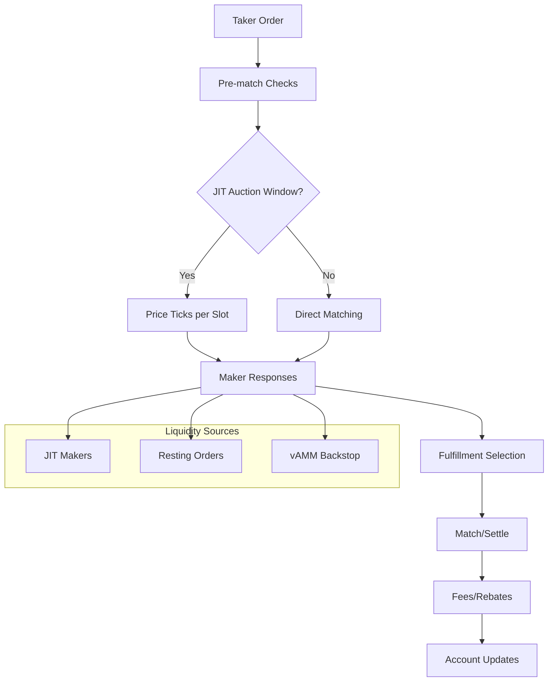
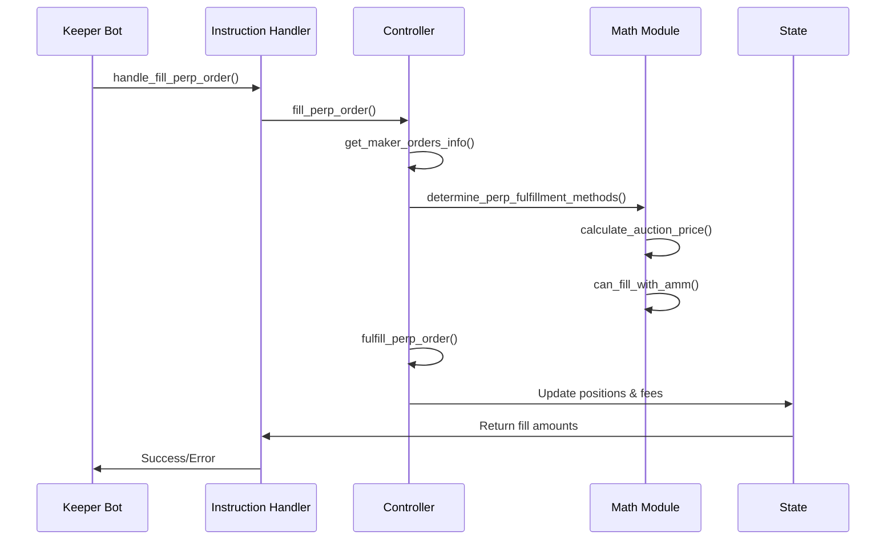

# Drift JIT and Matching Engine Overview

Drift's matching engine implements a hybrid order execution system combining Just-In-Time (JIT) auctions with traditional order book matching. When a taker order is submitted, it triggers a Dutch auction where makers can provide reactive liquidity within a specified time window. The system prioritizes JIT makers over resting orders due to same-slot execution advantages, while using the vAMM as a backstop liquidity provider. The matching engine supports three liquidity sources: JIT makers, resting DLOB orders, and the vAMM, with sophisticated price validation and risk management throughout the execution flow.

## Glossary

- **JIT (Just-In-Time)**: Reactive liquidity provision where makers respond to taker orders within the same slot
- **JIT Auction**: Dutch auction mechanism where price linearly decreases/increases over time slots
- **Taker**: Order initiator seeking liquidity (buyer/seller)
- **Maker**: Liquidity provider (resting orders or JIT responders)
- **Order Types**: Market, Limit, TriggerMarket, TriggerLimit with optional auction parameters
- **Lots/Ticks**: Order size and price granularity units
- **Crank/Keeper**: Off-chain bots that monitor and execute order matching
- **Risk Checks**: Pre/post-trade margin, collateral, and position validation
- **Partial Fills**: Orders filled incrementally across multiple makers
- **Settlement**: Final position updates, fee collection, and account reconciliation

## High-Level Architecture

### Components

**Programs/Crates:**
- `drift` program: Core matching engine logic (programs/drift/src/)
- `math/` module: Auction pricing, JIT calculations, fulfillment methods
- `controller/orders.rs`: Main order execution flow
- `state/`: Account structures and data models

**On-Chain Accounts:**
- `User`: Individual trader accounts with positions and orders
- `PerpMarket`: Market configuration and AMM state
- `State`: Global protocol parameters and guardrails
- `Oracle`: Price feed data and validation

**Clients/Bots:**
- SDK: Client-side order management and market data
- Keeper bots: order matching and execution
- JIT makers: Reactive liquidity providers

### JIT Integration Flow

1. **Order Submission**: Taker submits order with auction parameters
2. **Auction Window**: Price ticks per slot (400ms) during auction duration
3. **Maker Response**: JIT makers observe and respond with liquidity
4. **Fulfillment Selection**: Engine selects best combination of makers/AMM
5. **Execution**: Orders matched and settled with fee distribution

## End-to-End Flow



## Entry Points & Call Graphs

### Primary Entry Points

**1. `fill_perp_order` Instruction** (lib.rs:472-477)
```rust
pub fn fill_perp_order<'c: 'info, 'info>(
    ctx: Context<'_, '_, 'c, 'info, FillOrder<'info>>,
    order_id: Option<u32>,
) -> Result<()>
```

**2. `handle_fill_perp_order` Handler** (instructions/keeper.rs:86-150)
```rust
pub fn handle_fill_perp_order<'c: 'info, 'info>(
    ctx: Context<'_, '_, 'c, 'info, FillOrder<'info>>,
    order_id: Option<u32>,
) -> Result<()>
```

### Call Chain Sequence



### Key Functions

**`get_maker_orders_info`** (controller/orders.rs:1481-1579)
- Gathers potential maker orders for taker
- Validates maker eligibility and order compatibility
- Returns sorted list of (maker_key, order_index, price)

**`determine_perp_fulfillment_methods`** (math/fulfillment.rs:15-105)
- Evaluates available liquidity sources
- Prioritizes makers over AMM when price competitive
- Returns ordered list of fulfillment methods

**`fulfill_perp_order`** (controller/orders.rs:1732-1829)
- Executes order matching and settlement
- Handles partial fills across multiple makers
- Updates positions and collects fees

## State & Data Models

### Core Structs

**`Order`** (state/user.rs)
```rust
pub struct Order {
    pub market_index: u16,           // Market identifier
    pub order_type: OrderType,       // Market/Limit/Trigger
    pub auction_start_price: i64,    // Auction start price
    pub auction_end_price: i64,      // Auction end price  
    pub auction_duration: u8,        // Auction slots
    pub base_asset_amount: u64,      // Order size
    pub price: u64,                  // Limit price
    pub direction: PositionDirection, // Long/Short
    pub status: OrderStatus,         // Open/Filled/Cancelled
    pub slot: u64,                   // Creation slot
    pub order_id: u32,               // Unique identifier
}
```

**`PerpMarket`** (state/perp_market.rs)
```rust
pub struct PerpMarket {
    pub amm: AMM,                    // AMM state and parameters
    pub amm_jit_intensity: u8,       // JIT participation level
    pub amm_lp_allowed_to_jit_make: bool, // LP JIT permissions
    pub min_perp_auction_duration: u8,    // Minimum auction slots
    pub oracle_guard_rails: OracleGuardRails, // Price validation
}
```

**`AMM`** (state/perp_market.rs)
```rust
pub struct AMM {
    pub base_asset_reserve: u128,    // Base asset liquidity
    pub quote_asset_reserve: u128,   // Quote asset liquidity
    pub bid_price: u64,              // Current bid price
    pub ask_price: u64,              // Current ask price
    pub order_tick_size: u64,        // Price granularity
    pub order_step_size: u64,        // Size granularity
}
```

### Enums

**`PerpFulfillmentMethod`** (state/events.rs)
```rust
pub enum PerpFulfillmentMethod {
    Match(Pubkey, u16, u64),         // (maker_key, order_index, price)
    AMM(Option<u64>),                // AMM fill with optional price
}
```

**`FillMode`** (state/fill_mode.rs)
```rust
pub enum FillMode {
    Fill,                            // Normal execution
    Cancel,                          // Order cancellation
    Trigger,                         // Trigger order activation
}
```

## JIT Lifecycle

### Trigger Conditions

**Auction Activation** (validation/order.rs:367-420)
- Market orders: Always have auction parameters
- Limit orders: Optional auction based on `auction_duration > 0`
- Post-only orders: Cannot have auctions

**JIT Eligibility** (state/perp_market.rs:1489-1520)
```rust
pub fn amm_wants_to_jit_make(&self, taker_direction: PositionDirection) -> DriftResult<bool>
pub fn amm_lp_wants_to_jit_make(&self, taker_direction: PositionDirection) -> DriftResult<bool>
```

### Timeline Mechanics

**Auction Duration** (math/auction.rs:75-100)
- Price ticks every slot (400ms)
- Linear interpolation between start/end prices
- Minimum duration: `min_perp_auction_duration` slots
- Maximum duration: Order-specified `auction_duration`

**Priority Rules** (controller/orders.rs:1579-1620)
1. JIT makers: Same-slot execution advantage
2. Resting orders: Price-time priority
3. vAMM: Backstop when others unavailable

### Maker Selection Logic

**Price Validation** (math/fulfillment.rs:45-75)
```rust
let taker_crosses_maker = do_orders_cross(maker_direction, maker_price, taker_price);
let maker_better_than_amm = match order.direction {
    PositionDirection::Long => maker_price <= amm_price,
    PositionDirection::Short => maker_price >= amm_price,
};
```

**JIT Amount Calculation** (math/amm_jit.rs:12-116)
- Maximum 50% of maker's offered size
- Scaled by `amm_jit_intensity` (0-200)
- Reduced for wash trade detection
- Increased for market imbalance

### Failure Paths

**Oracle Stale** (controller/orders.rs:1777-1785)
- Falls back to exchange oracle if MM oracle stale
- Rejects fills if both oracles invalid

**Insufficient Liquidity** (math/fulfillment.rs:25-30)
- Returns empty fulfillment methods
- Order remains open for future attempts

**Risk Violations** (controller/orders.rs:1580-1620)
- Margin ratio checks before execution
- Position size limits enforced
- Liquidation triggers if needed

## Matching Engine Mechanics

### Order Validation

**Pre-trade Checks** (validation/order.rs:51-100)
- Price bounds validation
- Auction parameter consistency
- Oracle price band compliance
- Market status verification

**Maker Validation** (controller/orders.rs:1510-1570)
- Account solvency check
- Order compatibility verification
- Same-market, opposite-side requirement
- JIT order ID matching (if specified)

### Price-Time Priority

**Resting Orders** (controller/orders.rs:1481-1579)
- Sorted by price, then timestamp
- Protected maker minimum age enforcement
- Oracle price band validation

**JIT Orders** (math/fulfillment.rs:45-75)
- Same-slot execution priority
- Price competitiveness required
- Size limits based on intensity

### Partial Fills

**Incremental Execution** (controller/orders.rs:1785-1829)
```rust
for fulfillment_method in fulfillment_methods.iter() {
    if user.orders[user_order_index].status != OrderStatus::Open {
        break;
    }
    // Execute partial fill
    base_asset_amount += fill_base_asset_amount;
    quote_asset_amount += fill_quote_asset_amount;
}
```

**Maker Allocation** (controller/orders.rs:1800-1820)
- Proportional allocation across makers
- AMM participation when price competitive
- Fee distribution to all participants

### Crossing Logic

**Order Crossing** (math/fulfillment.rs:50-55)
```rust
let taker_crosses_maker = do_orders_cross(maker_direction, maker_price, taker_price);
```

**AMM Integration** (math/fulfillment.rs:75-85)
- AMM provides liquidity when makers insufficient
- Price improvement over AMM quotes
- Backstop for all remaining size

## Risk, Fees, and Settlement

### Pre-trade Risk Checks

**Margin Validation** (controller/orders.rs:1580-1620)
- Initial margin ratio verification
- Maintenance margin monitoring
- Collateral adequacy check

**Position Limits** (state/user.rs)
- Maximum position size enforcement
- Leverage limits per market
- Cross-margin calculations

### Post-trade Accounting

**Position Updates** (controller/position.rs)
- Base asset amount adjustment
- Quote asset amount settlement
- Unrealized PnL calculation

**Fee Collection** (controller/orders.rs:1820-1829)
- Taker fees: Based on fill amount
- Maker rebates: Percentage of taker fees
- Protocol fees: Remaining portion

### Fee/Rebate Flows

**JIT vs Normal Matches** (state/perp_market.rs:365-375)
- JIT makers: Enhanced rebates for same-slot execution
- Resting makers: Standard rebate structure
- AMM: No rebates, protocol retains fees

**Maker Rebates** (controller/orders.rs:1800-1820)
```rust
let maker_rebate = fill_quote_asset_amount
    .safe_mul(maker_rebate_numerator)?
    .safe_div(maker_rebate_denominator)?;
```

### Liquidation Interactions

**Margin Monitoring** (controller/liquidation.rs:1090-1120)
- Continuous margin ratio tracking
- Liquidation trigger on threshold breach
- Forced position closure

**JIT Liquidation** (controller/liquidation.rs)
- JIT makers can participate in liquidations
- Enhanced rebates for liquidation fills
- Risk management through position limits

## Performance & Determinism

### Compute Unit Hotspots

**Auction Price Calculation** (math/auction.rs:75-100)
- Linear interpolation per slot
- Oracle price validation
- Tick size standardization

**Fulfillment Method Selection** (math/fulfillment.rs:15-105)
- Maker order sorting and filtering
- AMM price comparison
- Priority queue management

**JIT Amount Calculation** (math/amm_jit.rs:12-116)
- Market imbalance detection
- Wash trade analysis
- Intensity scaling

### Caching Strategies

**Oracle Price Caching** (state/oracle.rs)
- Price data cached per slot
- Staleness validation
- Fallback to exchange oracle

**AMM State Caching** (state/perp_market.rs)
- Reserve updates batched
- Price calculations cached
- Rebalancing deferred

### Keeper Bot Loops

**Order Monitoring** (instructions/keeper.rs:86-150)
- Continuous order book scanning
- Cross-order opportunity detection
- Fill execution prioritization

**JIT Response** (instructions/keeper.rs)
- Same-slot order placement
- Price improvement strategies
- Risk management enforcement

## Operational & Testing Notes

### Crank/Bot Processes

**Fill Order Bot** (instructions/keeper.rs:86-150)
```bash
# Monitor open orders
# Detect crossing opportunities  
# Execute fills with optimal routing
# Collect fees and rebates
```

**JIT Maker Bot** (math/amm_jit.rs:154-219)
```bash
# Monitor auction windows
# Calculate optimal JIT amounts
# Place reactive orders
# Manage risk exposure
```

### Test Files

**JIT Tests** (controller/orders/amm_jit_tests.rs:1-3094)
- AMM JIT participation scenarios
- Intensity scaling validation
- Wash trade detection

**Auction Tests** (math/auction/tests.rs)
- Price calculation accuracy
- Duration and timing validation
- Edge case handling

**Fulfillment Tests** (math/fulfillment/tests.rs:1-891)
- Maker selection logic
- Partial fill scenarios
- Priority ordering

### E2E Scenarios

**Basic JIT Flow** (controller/orders/amm_jit_tests.rs:279-469)
```rust
// 1. Place taker order with auction
// 2. AMM provides JIT liquidity
// 3. Order fills at auction price
// 4. Verify position updates
```

**Multi-Maker Scenario** (controller/orders/tests.rs:464-712)
```rust
// 1. Multiple makers respond to auction
// 2. Best prices selected first
// 3. Partial fills across makers
// 4. Fee distribution verification
```

## Open Questions / TODOs

### Implementation Ambiguities

**JIT Intensity Scaling** (math/amm_jit.rs:58-66)
- Exact formula for intensity-based scaling unclear
- Interaction with market imbalance detection needs clarification

**Protected Maker Logic** (controller/orders.rs:1580-1620)
- Minimum age enforcement mechanism
- Priority over regular makers not fully documented

**Oracle Fallback** (controller/orders.rs:1777-1785)
- Specific conditions for MM vs exchange oracle selection
- Staleness threshold values need verification

### Known Limitations

**Same-Slot Self-Trading** (instructions/keeper.rs:668-672)
- JIT makers cannot fill their own orders
- Complex validation logic for same-authority detection

**Auction Price Granularity** (math/auction.rs:75-100)
- Price ticks limited by slot timing
- Sub-slot price interpolation not supported

**AMM JIT Participation** (state/perp_market.rs:1489-1520)
- Intensity-based participation may be suboptimal
- No dynamic adjustment based on market conditions

## Citations

Throughout this document, code references follow the format `(path:lineStart-lineEnd)`:

- Main fulfillment function: (controller/orders.rs:1732-1829)
- JIT amount calculation: (math/amm_jit.rs:12-116)  
- Auction price logic: (math/auction.rs:75-100)
- Maker selection: (math/fulfillment.rs:15-105)
- Order validation: (validation/order.rs:367-420)
- Fee calculation: (controller/orders.rs:1800-1820)
- Risk checks: (controller/orders.rs:1580-1620)
- Keeper entry point: (instructions/keeper.rs:86-150)

## How to Reproduce Locally

### Setup Test Environment

```bash
# Clone protocol-v2 repository
git clone https://github.com/drift-labs/protocol-v2.git
cd protocol-v2

# Install dependencies
cargo build

# Run JIT tests
cargo test amm_jit_tests -- --nocapture

# Run auction tests  
cargo test auction_tests -- --nocapture

# Run fulfillment tests
cargo test fulfillment_tests -- --nocapture
```

### Key Test Scenarios

**JIT Participation Test** (controller/orders/amm_jit_tests.rs:279-469)
```rust
#[test]
fn test_amm_jit_participation() {
    // Setup market with JIT intensity
    // Place taker order with auction
    // Verify AMM provides JIT liquidity
    // Check fill execution and fees
}
```

**Multi-Maker Auction Test** (controller/orders/tests.rs:464-712)
```rust
#[test] 
fn test_multi_maker_auction() {
    // Setup multiple makers
    // Place taker order triggering auction
    // Verify maker selection and fills
    // Validate fee distribution
}
```
